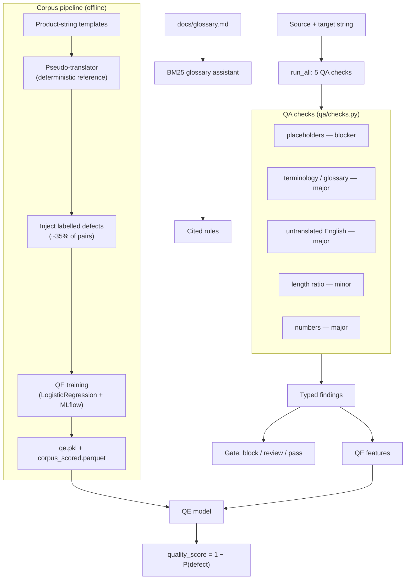

<div align="center">


</div>

# TranslateGate — Machine Translation QA Gate

**A quality gate for localized strings.** TranslateGate checks a source string against its translation, fires typed findings for the ways machine translation tends to break UIs — dropped placeholders, off-glossary brand terms, leftover English, number drift, length blowouts — and combines them into a single `pass` / `review` / `block` decision. A small learned model turns those signals into a quality score, and a cited glossary assistant explains *why* a term is wrong.

<div align="center">

[](https://www.python.org/)
[](https://fastapi.tiangolo.com/)
[](https://pytest.org/)
[](https://opensource.org/licenses/MIT)

</div>

> **Portfolio project.** Built to demonstrate rule-based QA, feature-based quality estimation, and a small retrieval assistant on synthetic localization data. Not hardened for production use.

---

## The problem

Localization pipelines push thousands of translated strings into a UI, and a translation that reads fine can still crash or embarrass the product: a dropped `{count}` placeholder throws at render time, "checkout" rendered as "zahlung" breaks brand-mandated terminology, a half-translated string leaks English into a German screen, and a 3x-longer string overflows a button. These are cheap to catch mechanically but expensive to catch by eye at scale.

TranslateGate treats the translated string as something to be **gated**, not trusted: run a fixed battery of checks, each producing an auditable finding with a severity and a rule id, then decide whether the string ships, needs review, or is blocked.

## What it does

- **Checks a string pair** and returns typed findings plus a gate decision (`pass` / `review` / `block`).
- **Scores quality** with a learned model that maps check signals to a 0–1 quality estimate.
- **Summarizes a corpus** — how many strings, what defects were planted, how well each check detects them.
- **Answers glossary questions** with citations back to the actual style-guide rule.

## How it works

A source/target pair runs through five deterministic checks. The findings both drive the rule-based gate and become features for a logistic-regression quality estimator trained on a synthetic corpus of planted defects.



### The five checks

| Check | Severity | What it catches | Rule source |
|---|---|---|---|
| `placeholders` | `blocker` | `{var}` / `%s` / `%d` present in source but missing or changed in target | regex set-compare |
| `terminology` | `major` | Glossary term not translated to its mandated form, or a forbidden variant used | `docs/glossary.md` |
| `untranslated` | `major` | Common English function words left in the target | English-hint list |
| `length` | `minor` | Target/source length ratio outside `[0.6, 1.9]` (truncation / info-loss risk) | `configs/config.yaml` |
| `numbers` | `major` | Numeric tokens differ between source and target | regex set-compare |

The gate is conservative: any `blocker` finding → `block`; any finding at all → `review`; otherwise `pass`.

### Quality estimation

The learned score is deliberately simple and interpretable. Each pair is reduced to five features — placeholder-count mismatch, number of findings, length ratio, count of English-leftover hits, and copy rate (fraction of target tokens copied verbatim from the source) — and a standardized `LogisticRegression` predicts the probability that the pair is defective. The API returns `quality_score = 1 − P(defect)`. Training runs are logged to MLflow.

### Synthetic corpus

Because there's no labelled ground truth to train against, the project generates one. A deterministic pseudo-translator produces the "correct" target for each templated product string (glossary terms map to their mandated forms; placeholders and numbers pass through untouched). Defects are then injected into ~35% of pairs with a ground-truth label naming *which* check should fire — so detection precision/recall is measurable per check.

### Glossary assistant

`docs/glossary.md` is parsed into rules and indexed with BM25 (`rank_bm25`). A question is tokenized and matched against the index, returning the top rules above a score threshold — each with its `rule_id`, so answers cite the exact style-guide entry rather than paraphrasing.

### Contract module (standalone)

`src/translategate/contract/` is a separate, self-contained component: a `TranslationContract` dataclass plus a `ContractValidator` that expresses the same invariants (placeholders, numbers, expansion ratio, glossary, forbidden terms) as a formal per-language-pair contract and can export a JSON Schema for boundary validation. It's not on the `/check` request path — it's an alternative, contract-first framing of the same rules, exercised by its own test suite.

## Getting started

```bash
make install                 # uv sync --group dev
```

Build the synthetic corpus and train the quality estimator (required — the API returns `503` on `/check` and `/corpus/summary` until the artifacts exist):

```bash
uv run python scripts/make_corpus.py          # writes data/processed/corpus.parquet
uv run python -m translategate.models.train    # writes data/artifacts/qe.pkl + corpus_scored.parquet
```

Run the services:

```bash
make api                     # FastAPI on http://localhost:8370
make ui                      # Streamlit on http://localhost:8871 (talks to the API)
make mlflow                  # MLflow UI on http://localhost:5038
```

Or with Docker:

```bash
make docker-up               # api on :8370, ui on :8871
make docker-down
```

## API

| Method | Route | Purpose |
|---|---|---|
| `GET` | `/health` | Liveness check |
| `POST` | `/check` | Gate one string pair → `{quality_score, gate, findings}` |
| `GET` | `/corpus/summary` | Corpus size, planted-defect counts, and training metrics |
| `POST` | `/glossary/ask` | Retrieve cited glossary rules for a question |

Example (illustrative output shape on synthetic data, not a benchmark):

```bash
curl -s localhost:8370/check -H 'content-type: application/json' \
  -d '{"source":"Your cart has {count} items ready for checkout",
       "target":"rauya korv seh items ydeara rofa zahlung"}'
```

```json
{
  "quality_score": 0.12,
  "gate": "block",
  "findings": [
    {"check": "placeholder", "severity": "blocker", "rule_id": "placeholders",
     "detail": "source has ['{count}'], target has none"},
    {"check": "terminology", "severity": "major", "rule_id": "term-checkout",
     "detail": "forbidden variant 'zahlung' used for 'checkout'"}
  ]
}
```

## Evaluation

Evaluation runs on the synthetic corpus, where every planted defect carries a ground-truth label naming the check that should catch it — so there is a real target to measure against. The training script reports, per check, precision and recall against the planted defects, plus ROC-AUC for the quality estimator and the overall defect rate. To reproduce:

```bash
uv run python scripts/make_corpus.py
uv run python -m translategate.models.train   # prints and logs the metrics to MLflow
```

Numbers are intentionally omitted here because they depend on the generated dataset, defect rate, and seed (`configs/config.yaml`); run the script to produce them for your configuration.

## Testing

```bash
make test                    # uv run pytest --cov
```

- `test_translategate.py` — pseudo-translator invariants, per-check detection, QE quality, glossary assistant, and API contract
- `test_contract_validation.py` — the standalone contract validator and its JSON Schema export

## Limitations

- The bundled corpus is **synthetic**: templated strings and a pseudo-translator stand in for real MT output, so thresholds and the QE model would need recalibration on real translation data.
- Checks are language-agnostic regex/lexical rules; the glossary and forbidden-term lists are BrandCo demo data, not a real localization glossary.
- `untranslated` detection keys off a small English-hint word list and will miss anything outside it.
- The quality estimator is a linear model over five hand-picked features — interpretable, but not a substitute for a learned MT quality-estimation system.

## Project structure

```
src/translategate/
├── qa/         # The core: 5 QA checks + the deterministic pseudo-translator
├── models/     # Feature-based quality estimation (LogisticRegression + MLflow)
├── rag/        # BM25 glossary assistant with rule citations
├── contract/   # Standalone contract validator + JSON Schema export
├── api/        # FastAPI app (main:app) and routes
└── ui/         # Streamlit workbench (check / corpus / glossary tabs)
scripts/        # Synthetic corpus generator with planted, labelled defects
docs/           # glossary.md — style rules used for checks and RAG citations
configs/        # config.yaml — paths, check thresholds, corpus size
```

## License

MIT

---

<div align="center">

**Jackson Marcus** · Senior AI & Machine Learning Engineer

[](https://github.com/jackson-marcus)
[](mailto:wajahatanees41@gmail.com)

</div>
