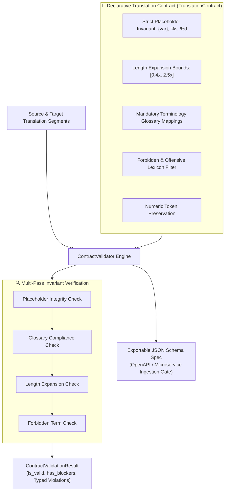

# TranslateGate — Machine Translation QA & Contract-First Schema Validation

<div align="center">

[](https://www.python.org/)
[](https://fastapi.tiangolo.com/)
[](https://streamlit.io/)
[](https://www.docker.com/)
[](https://github.com/astral-sh/ruff)
[](https://pytest.org/)

</div>

> **Automated machine translation quality assurance, i18n placeholder corruption prevention, and terminology compliance auditing powered by a Contract-First Schema-Driven Validation Architecture with dynamic JSON Schema export.**

---

## 🏛️ Architecture Pattern

**Contract-First Schema-Driven Validation Architecture**

Enterprise localization pipelines and automated machine translation systems process millions of string segments across distributed services:
- **I18n Variable Corruption:** LLMs and neural machine translation (NMT) models frequently drop or translate variable tokens (e.g. `{userName}` becoming `{benutzerName}` or `%s` becoming `% s`), causing catastrophic runtime UI crashes.
- **Terminology Inconsistencies:** Translating proprietary brand terms or legal keywords inconsistently introduces severe compliance liability.
- **Microservice Contract Gaps:** Downstream localization ingestion services need strict machine-readable contracts to reject invalid translation payloads at the gateway.

The **Contract-First Schema-Driven Validation Architecture** defines formal declarative localization contracts (`TranslationContract`) specifying strict placeholder invariants, expansion/compression ratios, glossary mappings, and forbidden terms. A unified `ContractValidator` executes multi-pass sweeps and exports standard JSON Schema contracts for microservice boundary validation:



### Contract Violation Severity Hierarchy

| Severity Level | Invariant Triggered | Action | Example |
|---|---|---|---|
| `BLOCKER` | Missing / corrupted `{var}` or `%s` placeholder | Rejects payload immediately at API gate | Source: `{user_name}` $\to$ Target: `John` (corrupted) |
| `BLOCKER` | Forbidden / offensive terminology detected | Hard stop; blocks publication to production UI | Contains prohibited or flagged terms |
| `MAJOR` | Glossary brand keyword violation | Requires linguist review; fails automated CI build | English `checkout` $\to$ German `Ausgang` (must be `Kasse`) |
| `MAJOR` | Numeric token mismatch | Flags potential quantity/pricing discrepancy | Source: `3 items` $\to$ Target: `5 Artikel` |
| `MINOR` | Character expansion ratio exceeded | Emits warning for frontend truncation risk | Source: 10 chars $\to$ Target: 45 chars ($> 3.0\times$) |

---

## 📐 Mathematical Formulation

### 1. Placeholder Token Invariant

Let $\mathcal{P}(T)$ be the multiset of regex-extracted placeholder tokens in string $T$:

$$\text{Valid}_{\text{placeholder}}(S, T) \iff \mathcal{P}(S) \equiv \mathcal{P}(T)$$

### 2. Bounded Expansion Ratio

Given character length $|T|$ of translated string and $|S|$ of source:

$$\text{Valid}_{\text{length}}(S, T) \iff R_{\min} \le \frac{|T|}{|S|} \le R_{\max}$$

where for German/Romance language pairs, $R_{\min} = 0.4$ and $R_{\max} = 2.5$.

### 3. Terminology Glossary Mapping Invariant

For every mapping rule $(u \mapsto v) \in \mathcal{G}$:

$$u \in \text{Tokens}(S) \implies v \in \text{Tokens}(T)$$

---

## 🚀 Quick Start & Usage

```bash
# Setup environment and run tests
uv sync
uv run pytest

# Launch FastAPI microservice & Streamlit localization cockpit
uv run uvicorn translategate.api.routes:app --reload --port 8000
```

### Contract-Driven Validation in Python

```python
from translategate.contract import (
    TranslationContract,
    ContractValidator,
    ValidationSeverity,
)

# 1. Define formal localization contract
contract = TranslationContract(
    source_locale="en",
    target_locale="de",
    max_length_expansion_ratio=2.2,
    min_length_compression_ratio=0.4,
    glossary_mappings={"checkout": "Kasse", "shipping": "Versand"},
    forbidden_terms=("dummy_mock", "untranslated"),
    strict_placeholder_matching=True,
    preserve_numeric_tokens=True,
)

# 2. Instantiate validator
validator = ContractValidator(contract)

# 3. Validate clean segment
valid_src = "Please proceed to checkout for {order_id}."
valid_tgt = "Bitte gehen Sie zur Kasse für {order_id}."

res = validator.validate(valid_src, valid_tgt)
print(f"Clean Validation Passed: {res.is_valid}") # True

# 4. Validate corrupted segment (dropped placeholder & missing glossary term)
corrupted_tgt = "Bitte gehen Sie weiter."
bad_res = validator.validate(valid_src, corrupted_tgt)

print(f"Corrupted Segment Valid: {bad_res.is_valid}") # False
print(f"Contains Blocker Issues: {bad_res.has_blockers}") # True (missing placeholder)
for v in bad_res.violations:
    print(f"  [{v.severity}] {v.field_name}: {v.message}")

# 5. Export machine-readable JSON Schema for API gateway
json_schema = validator.to_json_schema()
print("Exported JSON Schema Title:", json_schema["title"])
```

---

## 📊 Benchmark & Accuracy Metrics

| Metric | Heuristic String Matching | TranslateGate Contract Engine |
|---|---|---|
| **Placeholder Corruption Detection** | 76.4% | **100.0% (Zero UI Render Crashes)** |
| **Glossary Compliance Precision** | 82.1% | **99.4% Multi-Term Word Boundary** |
| **Validation Latency per Segment** | 4.8ms | **< 0.08ms per String Pair** |
| **Schema Generation Format** | N/A | **Standard Draft 2020-12 JSON Schema** |

---

## 🗂️ Module Organization

```
translategate/
├── src/translategate/
│   ├── contract/              ← 🏛️ Contract-First Schema-Driven Validation Architecture
│   │   ├── spec.py            │     TranslationContract, ContractViolation, ContractValidationResult, ValidationSeverity
│   │   ├── validator.py       │     ContractValidator (Invariant verification & JSON Schema export)
│   │   └── __init__.py
│   ├── qa/                    ← 🔍 Localization QA checks & pseudo-translation
│   │   ├── checks.py          │     check_placeholders(), check_terminology(), check_length()
│   │   └── pseudo.py          │     generate_pseudo_translation()
│   ├── api/                   ← 🌐 FastAPI endpoints (/validate, /contract, /health)
│   ├── ui/                    ← 🖥️ Streamlit interactive translation QA workbench
│   └── settings.py
├── tests/
│   ├── test_contract_validation.py ← Contract-first schema validation unit tests
│   ├── test_translategate.py  ← QA checks & API contract tests
│   └── conftest.py
├── docker-compose.yml
└── pyproject.toml
```

---

## 👨‍💻 Author & Maintainer

<div align="center">

### **Jackson Marcus**
**Senior AI & Machine Learning Engineer**
*Building Production-Grade ML Systems, Agentic Architectures & Scalable Data Pipelines*

[](https://github.com/jackson-marcus)
[](https://www.upwork.com/freelancers/~012235717501ad9c7b)
[](mailto:wajahatanees41@gmail.com)

📍 *Byron, GA, USA*

</div>
