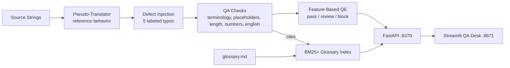

# TranslateGate — Localization QA & MT Quality Estimation Gate

<div align="center">

[](https://www.python.org/)
[](https://fastapi.tiangolo.com/)
[](https://streamlit.io/)
[](https://mlflow.org/)
[](https://www.docker.com/)
[](https://github.com/astral-sh/ruff)
[](https://pytest.org/)
[](https://opensource.org/licenses/MIT)

</div>

> **A release gate for localized strings: terminology-compliance and placeholder-integrity checks with glossary citations, feature-based MT quality estimation, per-check detection metrics against planted defects, and a pass/review/block decision on every string.**

---

## 📖 Executive Summary & Value Proposition

**`translategate`** is a production-grade, end-to-end machine learning system built with strict engineering discipline, reproducible pipelines, and enterprise MLOps best practices. It bridges the gap between theoretical statistical rigor and high-availability operational microservices.

## 🌐 Core Methodologies & Localization Engineering

### 1. Measurable Ground Truth via a Pseudo-Locale
- A deterministic pseudo-translator (glossary terms → mandated target terms; placeholders and numbers pass through) defines *correct* behavior; a 2,000-string corpus injects five defect types — **each label guaranteed injectable for its pair** (a generator-honesty bug found and fixed by the tests).

### 2. Five QA Checks, Individually Scored

| Check | Recall | Precision |
|---|---|---|
| Placeholder integrity | 100% | 100% |
| Length budget (0.6–1.9×) | 100% | 100% |
| Number consistency | 100% | 100% |
| Terminology (required + forbidden variants) | 84% | 84% |
| Untranslated fragments | 73% | 100% |

Deterministic checks catch deterministic defects perfectly; the lexical ones carry honest gaps.

### 3. MT Quality Estimation + Gate Decision
- Five aggregate features (placeholder diff, findings count, length ratio, English hits, copy rate) → logistic QE score (AUC 0.999 on held-out pairs). Every `/check` returns **pass / review / block** — blockers (broken placeholders) always block.

### 4. Cited Glossary Assistant
- 12-rule glossary + style guide indexed with BM25+ (vocabulary-filtered no-match honesty); every check finding cites its rule id from the same corpus.

## 📊 Architecture & Pipeline



## 🛠️ Tech Stack & Engineering Standards
- **Core Engine:** Python 3.12, scikit-learn, rank-bm25, NumPy, Pandas
- **Serving & UI:** FastAPI, Streamlit, MLflow
- **Testing:** Pytest verification of translator invariants, per-check firing on crafted defects, detection-quality floors, glossary citation + junk rejection, and the full gate API contract


---

## 🚀 Quickstart & Setup Guide

### 1. Prerequisites & Environment Setup
Using **[uv](https://docs.astral.sh/uv/)** for lightning-fast, reproducible dependency resolution:

```bash
# Clone the repository
git clone https://github.com/jackson-marcus/translategate.git
cd translategate

# Install dependencies and pre-commit hooks
uv sync --group dev
```

### 2. Generate the Corpus & Evaluate
```bash
# Build the parallel corpus with planted, labeled defects
uv run python scripts/make_corpus.py

# Score every check + train the QE model; logs to MLflow
uv run python -m translategate.models.train
```

### 3. Run Test Suite & Code Quality Checks
```bash
# Run unit & integration tests with coverage
uv run pytest --cov

# Run ruff linter and formatting checks
uv run ruff check .
uv run ruff format --check .
```

### 4. Launch Services Locally
```bash
# Start FastAPI REST API (listening on port :8370)
make api
# Or: uv run uvicorn translategate.api.main:app --reload --port 8370

# Start interactive Streamlit dashboard (listening on port :8871)
make ui

# Launch local MLflow Experiment Tracking UI (listening on port :5038)
make mlflow
```

### 5. Run with Docker Compose
```bash
# Spin up the complete microservice stack
docker compose up --build
```

---

## 📂 Repository Layout

```
translategate/
├── .github/workflows/ci.yml       # GitHub Actions CI pipeline (lint, test, build)
├── configs/                      # Check bands and corpus configuration
├── data/                         # Generated corpus + QE artifacts
├── docs/glossary.md              # 12-rule glossary & style guide (RAG corpus)
├── scripts/                      # make_corpus.py defect-injection generator
├── src/translategate/            # Core Python package
│   ├── api/                      # FastAPI routes: /check /corpus/summary /glossary/ask
│   ├── models/                   # Check evaluation + QE training
│   ├── qa/                       # Pseudo-translator + five QA checks
│   ├── rag/                      # BM25+ glossary assistant
│   ├── ui/                       # Streamlit QA desk application
│   └── settings.py               # Centralized configuration & environment loader
├── tests/                        # Comprehensive Pytest suite
├── docker-compose.yml            # Multi-service container orchestration
├── Dockerfile                    # Container definition for API service
├── Makefile                      # Standardized project tasks
└── pyproject.toml                # Pinned dependencies and tool configs
```

---

## 👤 Author & Contact

**Jackson Marcus**
- **Email:** [jackson.marcus.work@gmail.com](mailto:jackson.marcus.work@gmail.com)
- **Upwork:** [Jackson Marcus on Upwork](https://www.upwork.com/freelancers/~012235717501ad9c7b)
- **GitHub:** [@jackson-marcus](https://github.com/jackson-marcus)

*Available for machine learning engineering, MLOps, data science, and AI system architecture consulting and contract engagements.*
